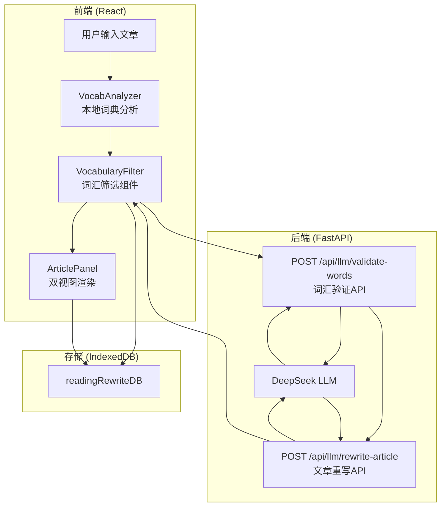

# 阅读板块词汇简化功能 - 设计文档

**日期**: 2026-04-07
**项目**: 阅读板块词汇简化功能重构
**状态**: 已批准

---

## 1. 概述

本文档描述阅读板块词汇简化功能的技术设计方案。核心思路是通过三步处理流程（本地词典初筛 → DeepSeek二次筛选 → 双视图渲染），为用户提供可理解的阅读体验。

---

## 2. 架构总览



---

## 3. 技术决策

| 决策项 | 选择 | 理由 |
|--------|------|------|
| API调用策略 | 分开调用 | 提示词更专注，准确度更高 |
| 费用展示 | 不做 | 用户要求跳过 |
| 代码处理 | 清理重构 | 彻底修复现有问题 |
| 重写粒度 | 词汇级 + 短语 | 支持2-3词短语替换 |

---

## 4. API 设计

### 4.1 POST /api/llm/validate-words

**用途**: DeepSeek 二次筛选，验证词典判断是否准确

**请求体**:
```json
{
  "sentence": "The eschew of modern technology requires careful consideration.",
  "words": ["eschew", "consideration", "technology"],
  "word_levels": {
    "eschew": "C1",
    "consideration": "B2",
    "technology": "B2"
  },
  "user_level": "B1",
  "target_level": "B2"
}
```

**响应体**:
```json
{
  "valid_i1_words": ["consideration", "technology"],
  "valid_above_i1_words": ["eschew"],
  "removed_words": [
    {"word": "some_word", "reason": "词典误标，实际为A2水平"}
  ],
  "word_levels": {
    "eschew": "C1",
    "consideration": "B2",
    "technology": "B2"
  }
}
```

### 4.2 POST /api/llm/rewrite-article

**用途**: 将 >i+1 词汇重写为 i+1 水平的表达

**请求体**:
```json
{
  "sentence": "The eschew of modern technology requires careful consideration.",
  "above_i1_words": ["eschew"],
  "word_levels": {
    "eschew": "C1"
  },
  "target_level": "B2"
}
```

**响应体**:
```json
{
  "rewritten_sentence": "Avoiding modern technology requires careful consideration.",
  "word_mappings": [
    {
      "original": "eschew",
      "simplified": "avoiding",
      "original_level": "C1"
    }
  ]
}
```

---

## 5. 前端组件设计

### 5.1 VocabularyFilter Hook

**位置**: `frontend/src/features/reading/useVocabularyFilter.js`

**职责**:
1. 调用 VocabAnalyzer 提取候选词汇
2. 调用 validate-words API
3. 调用 rewrite-article API
4. 管理处理状态

**接口**:
```javascript
const {
  // 状态
  isProcessing,
  error,
  
  // 数据
  originalText,
  rewrittenText,
  validI1Words,        // 有效i+1词
  validAboveI1Words,   // 有效>i+1词
  removedWords,        // 被过滤词
  wordMappings,        // 简化映射
  
  // 方法
  processArticle,
  reset
} = useVocabularyFilter();
```

### 5.2 ArticlePanel 修改

**位置**: `frontend/src/features/reading/ArticlePanel.jsx`

**新增功能**:
1. 集成 `useVocabularyFilter` Hook
2. 实现原文视图渲染
3. 实现重写版视图渲染
4. 支持视图切换

**视图渲染规则**:

| 类型 | 原文视图 | 重写视图 |
|------|----------|----------|
| i+1词 | 绿色下划线 | 无特殊样式 |
| >i+1词 | 红色下划线 | 无特殊样式 |
| 已简化词 | 黄色背景块+悬浮原文 | 黄色背景块+悬浮原文 |

### 5.3 CSS 样式

**位置**: `frontend/src/features/reading/reading.css`

```css
.word-i1 {
  text-decoration: underline;
  text-decoration-color: #22c55e;  /* 绿色 */
  text-underline-offset: 3px;
}

.word-above-i1 {
  text-decoration: underline;
  text-decoration-color: #ef4444;  /* 红色 */
  text-underline-offset: 3px;
}

.word-simplified {
  background-color: #fbbf24;  /* 黄色 */
  padding: 0 4px;
  border-radius: 3px;
  cursor: help;
}
```

---

## 6. IndexedDB Schema 更新

**数据库**: `readingRewriteDB`

**存储结构**:
```javascript
{
  id: string,              // UUID
  createdAt: timestamp,
  
  // 原始数据
  originalText: string,
  
  // 处理结果
  validI1Words: string[],
  validAboveI1Words: string[],
  removedWords: { word: string, reason: string }[],
  wordLevels: { [word]: string },
  wordMappings: { original: string, simplified: string, original_level: string }[],
  
  // 重写结果
  rewrittenText: string,
  
  // UI状态
  currentView: 'original' | 'rewritten'
}
```

---

## 7. 需要清理的旧代码

| 文件 | 清理原因 |
|------|----------|
| `frontend/src/features/reading/useReadingRewrite.js` | 错误的重写逻辑 |
| `frontend/src/features/reading/api/readingRewriteApi.js` | 旧API调用 |
| `app/api/routers/llm.py` 中的 `rewrite-text` 端点 | 功能已重新设计 |
| `app/infra/llm/deepseek.py` 中的 `rewrite_text` 函数 | 需要新实现 |

---

## 8. 实现步骤

### Phase 1: 后端API
1. 新增 `validate-words` API端点
2. 新增 `rewrite-article` API端点
3. 实现 DeepSeek 提示词

### Phase 2: 前端Hook
1. 创建 `useVocabularyFilter.js`
2. 实现三步处理流程

### Phase 3: UI组件
1. 重构 `ArticlePanel.jsx`
2. 添加CSS样式
3. 实现视图切换

### Phase 4: 存储
1. 更新 IndexedDB Schema
2. 实现历史记录持久化

### Phase 5: 清理
1. 删除旧的重写相关代码
2. 全面测试

---

## 9. 边界情况

| 情况 | 处理方式 |
|------|----------|
| 无候选词 | 提示用户"文章过于简单"，保留原文 |
| 全部过滤 | 保留原文，提示"所有词汇已掌握" |
| 重写失败 | 使用原文，显示警告 |
| API超时 | 显示错误，允许重试 |

---

## 10. 验收标准

- [ ] 用户粘贴文章后，系统正确识别 i+1 和 >i+1 词汇
- [ ] DeepSeek 能够过滤词典误标的简单词
- [ ] DeepSeek 将 >i+1 词重写为 i+1 水平的词/短语
- [ ] 原文视图正确显示绿色/红色下划线和黄色背景块
- [ ] 重写版视图显示简化后的全文
- [ ] 悬浮提示正确显示原文对照
- [ ] 历史记录支持视图切换，状态正确保存
