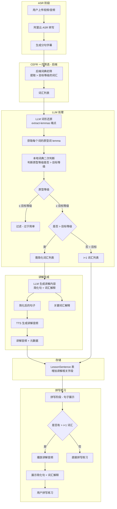

# 听力素材生成 CEFR 增强设计方案

## 1. 背景与目标

### 1.1 当前问题

当前听力素材的 CEFR 等级标记仅经过前端词典的一次筛选，未经过 LLM 词形还原和二次筛选。这导致以下问题：

- 高于用户 CEFR 等级的句子在拼写阶段缺乏辅助，降低学习效果
- 生词积累压力过大，不符合 i+1 可理解输入原则
- 听力难度与用户水平不匹配

### 1.2 目标

将阅读板块成熟的 CEFR 二次筛选机制（LLM 词形还原 + 词典二次判断）引入听力素材生成流程，并利用 TTS + LLM 对含有高于 i+1 词汇的句子在用户拼写阶段进行讲解，使听力难度降低到 i+1 水平，实现科学的语言学习。

## 2. 核心设计

### 2.1 整体流程



### 2.2 后端 CEFR 一次筛选

在 `lesson_service.py` 的 `build_subtitle_variant()` 方法中，新增后端词典筛选逻辑：

**输入**：
- 句子列表 `sentences[]`
- 用户目标 CEFR 等级 `target_level`

**处理**：
- 读取 `cefr_vocab_fixed.json` 词典数据
- 对每个句子提取词汇并查询 CEFR 等级
- 筛选出高于 `target_level` 的词汇

**输出**：
- 每个句子携带词汇元数据：`{ sentence_index, words: [{ word, level, start, end }] }`

### 2.3 LLM 词形还原 + 二次筛选

**复用现有端点**：
- `/api/llm/extract-lemmas` - 词形还原
- `/api/llm/filter-and-simplify-words` - 二次筛选 + 简化

**数据流**：
1. 后端将需简化的词汇列表发送至 LLM 端点
2. LLM 返回每个词的原型词 (lemma)
3. 本地词典二次判断原型等级
4. 过滤原型 ≤ 目标等级的词汇（词典误标）
5. 保留原型 = 目标等级的词汇为 i+1
6. 简化原型 > 目标等级的词汇

### 2.4 讲解生成

**讲解内容设计**：

采用"混合模式"讲解方式：
- **简化句**：将句子中的高难度词汇替换为 i+1 级别词汇
- **词汇解释**：对被替换的关键词汇提供中英对照解释
- **语速调整**：TTS 播放时使用略慢于正常语速

**LLM Prompt 模板**：

```python
EXPLAIN_SENTENCE_SYSTEM_PROMPT = """
You are an English listening comprehension tutor for language learning.
When a sentence contains vocabulary above the user's target level (i+1),
you need to generate an explanation that lowers the listening difficulty to i+1.

Output format:
{
    "simplified_sentence": "简化后的句子，保留i+1词汇",
    "key_explanations": [
        {
            "original_word": "原文词汇",
            "explanation": "英文或中文解释（1-2句话）",
            "simple_example": "简单例句（可选）"
        }
    ],
    "listen_tips": "听力技巧提示（可选）"
}

Rules:
- Only simplify words strictly above target level
- Keep all i+1 level vocabulary for learning
- Explanation should be clear and concise
- For listening practice, prioritize word substitution over complex grammar
"""
```

### 2.5 讲解音频生成

**TTS 配置**：
- 使用与听力句子相同的 TTS 音色
- 语速参数：`rate` 设为 0.9（略慢于正常）

**存储内容**：
- `explanation_audio_url` - 讲解音频 URL
- `explanation_text` - 讲解文本内容
- `simplified_sentence` - 简化后的句子
- `key_explanations` - 关键词解释 JSON

### 2.6 数据库模型扩展

在 `LessonSentence` 模型中新增字段：

```python
class LessonSentence(Base):
    # ... 现有字段 ...

    # CEFR 相关字段
    cefr_vocab_json = Column(JSON, nullable=True)  # 句子中词汇的CEFR等级信息
    needs_explanation = Column(Boolean, default=False)  # 是否需要讲解

    # 讲解相关字段
    explanation_text = Column(Text, nullable=True)  # 讲解文本
    simplified_sentence = Column(Text, nullable=True)  # 简化后的句子
    explanation_audio_url = Column(String, nullable=True)  # 讲解音频URL
    key_explanations_json = Column(JSON, nullable=True)  # 关键词解释
```

## 3. 拼写阶段讲解展示流程

### 3.1 流程描述

```
用户进入拼写练习
        │
        ▼
┌─────────────────────────┐
│ 获取当前句子           │
│ 检查 needs_explanation  │
└─────────────────────────┘
        │
        ▼
┌─────────────────────────┐
│ needs_explanation=True? │
└─────────────────────────┘
        │
    ┌───┴───┐
    │是     │否
    ▼       ▼
┌────────┐ ┌────────────────┐
│播放讲解│ │直接显示原句子   │
│音频    │ │等待用户拼写    │
└────────┘ └────────────────┘
    │
    ▼
┌─────────────────────────┐
│展示简化句 + 词汇解释    │
│用户可以反复收听讲解音频 │
└─────────────────────────┘
    │
    ▼
┌─────────────────────────┐
│用户点击"开始拼写"      │
│显示原句（听力句子）     │
│用户进行拼写练习        │
└─────────────────────────┘
```

### 3.2 前端 UI 交互

**讲解展示界面**：

```
┌────────────────────────────────────────────────┐
│  🔊 听力讲解                                  │
├────────────────────────────────────────────────┤
│                                                │
│  📝 简化句：                                   │
│  "The scientists are studying the effect      │
│   of climate on migration patterns."          │
│                                                │
│  📚 关键词解释：                               │
│  ┌────────────────────────────────────────┐   │
│  │ • effect (影响)                        │   │
│  │   → 事物引起的改变或结果               ��   │
│  │   例: The effect was very significant  │   │
│  ├────────────────────────────────────────┤   │
│  │ • migration (迁徙)                      │   │
│  │   → 动物或人的迁移移动行为             │   │
│  │   例: The migration of birds to south   │   │
│  └────────────────────────────────────────┘   │
│                                                │
│  [🔊 重新播放]  [▶ 开始拼写练习]              │
│                                                │
└────────────────────────────────────────────────┘
```

### 3.3 关键交互逻辑

| 操作 | 响应 |
|------|------|
| 句子需要讲解 | 自动播放讲解音频 + 展示讲解内容 |
| 用户点击"重新播放" | 再次播放讲解 TTS 音频 |
| 用户点击"开始拼写" | 切换到原句拼写模式 |
| 句子不需要讲解 | 直接进入拼写模式 |

## 4. 技术实现要点

### 4.1 后端新增模块

**新服务类**：`app/services/cefr_explain_service.py`

```python
class CefrExplainService:
    def __init__(self, db: Session, target_level: str):
        self.target_level = target_level
        self.vocab_data = self._load_vocab()

    def extract_cefr_words(self, sentences: List[str]) -> List[Dict]:
        """后端词典CEFR一次筛选"""

    def generate_explanation(self, sentence: str, words_above: List[Dict]) -> Dict:
        """生成讲解内容（调用LLM）"""

    def synthesize_explanation_audio(self, explanation_text: str) -> str:
        """生成讲解TTS音频"""
```

### 4.2 API 端点扩展

| 端点 | 方法 | 功能 |
|------|------|------|
| `/api/lessons/{lesson_id}/sentences/{index}/explanation` | GET | 获取句子讲解内容 |
| `/api/lessons/{lesson_id}/explain-audio/{index}` | GET | 获取讲解音频流 |
| `/api/lessons/generate-with-explanation` | POST | 生成带讲解的听力素材 |

### 4.3 前端组件扩展

**新增组件**：`frontend/src/features/immersive/ExplanationPanel.jsx`

- 展示讲解内容的卡片组件
- TTS 播放控制
- 简化句 + 词汇解释展示

**修改组件**：`ImmersiveLessonPage.jsx`

- 在拼写阶段前增加讲解展示逻辑
- 根据 `needs_explanation` 字段判断是否展示讲解

## 5. 实施计划

### Phase 1: 后端 CEFR 筛选增强
- 在 `lesson_service.py` 新增后端词典筛选逻辑
- 扩展 `LessonSentence` 模型字段
- 复用现有 LLM 端点实现二次筛选

### Phase 2: 讲解生成服务
- 创建 `cefr_explain_service.py`
- 实现 LLM 讲解内容生成
- 实现 TTS 讲解音频生成

### Phase 3: 拼写阶段讲解集成
- 前端新增 `ExplanationPanel` 组件
- 修改 `ImmersiveLessonPage` 拼写流程
- 添加讲解音频播放逻辑

### Phase 4: 测试与优化
- 单元测试和集成测试
- 性能优化（讲解缓存）
- 用户体验微调

## 6. 成功标准

1. **CEFR 准确性**：后端筛选的词汇 CEFR 等级准确率 ≥ 95%
2. **讲解有效性**：用户听完讲解后，能正确拼写原句比例 ≥ 80%
3. **性能要求**：讲解生成时间 < 5秒/句子
4. **用户体验**：讲解展示清晰，交互流畅
